# AI Workforce Management System
# 🤖 AI Workforce Management System

An **AI-powered employee task and productivity management system** designed to help organizations manage employees, projects, tasks, workload, and performance from a centralized web application.

The system includes separate portals for **Admin, Manager, and Employee**, along with an AI-based employee recommendation feature that analyzes employee performance and workload to recommend a suitable employee for new tasks.

---

## 📌 Project Overview

The **AI Workforce Management System** is a full-stack web application developed to simplify workforce and task management.

The system allows administrators to manage organizational data, managers to create projects and assign tasks, and employees to view and manage their assigned work.

A key feature of the project is the **AI Employee Recommendation System**, which analyzes factors such as:

* Employee performance
* Completed tasks
* Pending tasks
* Department
* Designation
* Current workload

and calculates an **AI recommendation score** to identify the most suitable employee for a new task.

---

## ✨ Key Features

### 👨‍💼 Admin Portal

The Admin can:

* Manage employees
* Manage departments
* Manage projects
* Manage tasks
* View workforce information
* View reports and analytics
* Monitor overall task progress
* View employee performance
* Access dashboard statistics
* Use dark mode across supported pages

---

### 👩‍💼 Manager Portal

The Manager can:

* View manager dashboard
* Manage projects
* View team members
* View employee performance
* Create and assign tasks
* View task information
* Monitor employee workload
* View reports and analytics
* Access employee profiles
* Upload/update profile pictures

---

### 👨‍💻 Employee Portal

Employees can:

* View their dashboard
* View assigned tasks
* Check task status
* View performance information
* View their profile
* Update their profile picture
* View personal information
* View work information
* Monitor their performance score
* View completed projects
* Check account status

---

## 🤖 AI Employee Recommendation

One of the main features of the project is the **AI Employee Recommendation System**.

When a manager/admin creates a new task, the system analyzes available employees and recommends the best candidate.

### Factors considered

The recommendation system considers:

1. **Task completion performance**
2. **Completed tasks**
3. **Pending tasks**
4. **Employee designation**
5. **Department**
6. **Current workload**

The system calculates an AI score and selects the employee with the highest suitable score while filtering employees with excessive pending tasks.

### Example workflow

```text
Create New Task
       ↓
Analyze Employees
       ↓
Check Completed Tasks
       ↓
Check Pending Tasks
       ↓
Calculate Performance
       ↓
Calculate AI Score
       ↓
Select Best Candidate
       ↓
Recommend Employee
```

The recommended employee is also automatically selected in the employee dropdown, while the manager can review the recommendation before saving the task.

---

## 📊 Reports & Analytics

The system provides a reports dashboard containing:

### Workforce Statistics

* Total Employees
* Total Departments
* Total Projects
* Total Tasks
* Pending Tasks
* Completed Tasks

### Project Progress

The system calculates project progress based on completed and total tasks.

```text
Project Progress =
Completed Tasks / Total Tasks × 100
```

### Employee Performance

The reports section displays:

* Employee name
* Total tasks
* Completed tasks

### AI Insights

The system generates insights based on the overall task completion rate, including:

* Completion rate
* Performance classification
* Productivity recommendation
* Project completion prediction
* Project delay risk

### Charts

The reports dashboard includes:

* 📊 Task Status Pie Chart
* 📈 Tasks Per Project Bar Chart

Charts are implemented using **Chart.js**.

---

## 👤 Profile Management

Employees and managers have profile pages containing information such as:

* Full name
* Employee ID
* Email
* Phone
* Gender
* Designation
* Department
* Workload
* Joining date
* Account status
* Performance score
* Completed projects

### 🖼️ Profile Picture

Users can upload profile pictures through the profile page.

Supported formats include:

* JPG
* JPEG
* PNG
* WebP

Uploaded profile pictures are stored in:

```text
assets/images/profiles/
```

---

## 🔐 Authentication & Access Control

The system uses session-based authentication.

Different users are redirected to different portals according to their role.

```text
Login
  ↓
Check User Role
  ↓
┌───────────────┐
│               │
Admin       Manager       Employee
│               │
↓               ↓               ↓
Admin Portal  Manager Portal  Employee Portal
```

Employees are protected from accessing manager/admin pages through role checks.

---

## 🛠️ Technologies Used

### Frontend

* HTML5
* CSS3
* JavaScript
* Bootstrap 5
* Bootstrap Icons
* Chart.js

### Backend

* PHP 8+
* MySQL
* MariaDB

### Development Environment

* XAMPP
* Apache
* MySQL/MariaDB
* phpMyAdmin
* Visual Studio Code

### Version Control

* Git
* GitHub

---

## 📁 Project Structure

```text
AI-Workforce-Management-System/
│
├── admin/
│   ├── dashboard.php
│   ├── employees.php
│   ├── departments.php
│   ├── projects.php
│   ├── tasks.php
│   └── ...
│
├── authentication/
│   ├── login.php
│   ├── logout.php
│   └── ...
│
├── config/
│   ├── database.php
│   ├── page_actions.php
│   └── upload_profile_picture.php
│
├── employee/
│   ├── dashboard.php
│   ├── tasks.php
│   ├── performance.php
│   ├── profile.php
│   ├── view.php
│   └── ...
│
├── manager/
│   ├── dashboard.php
│   ├── performance.php
│   ├── profile.php
│   ├── projects.php
│   ├── tasks.php
│   ├── team.php
│   └── ...
│
├── reports/
│   └── index.php
│
├── task/
│   └── add.php
│
├── assets/
│   └── images/
│       ├── logo/
│       └── profiles/
│
├── database/
│   └── ...
│
└── README.md
```

> The exact project structure may contain additional files depending on the current development version.

---

## 🗄️ Database

The application uses **MySQL/MariaDB** as its database.

Important entities include:

```text
Users
   │
   ├── Employees
   │
   └── Roles
       
Departments
   │
   └── Employees

Projects
   │
   └── Tasks

Employees
   │
   └── Tasks
```

### Main database entities

* Users
* Employees
* Departments
* Projects
* Tasks
* Roles

Relationships between these entities allow the system to track employee assignments, projects, tasks, performance, and workload.

---

## 📸 Project Screenshots

### 🏠 Home Page
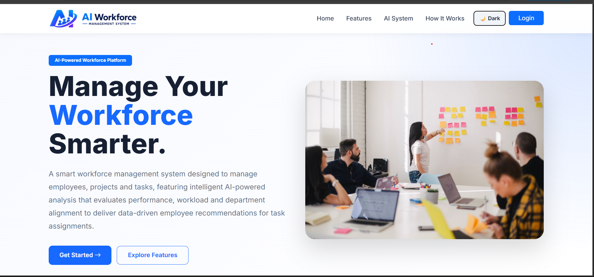

### 🔐 Login
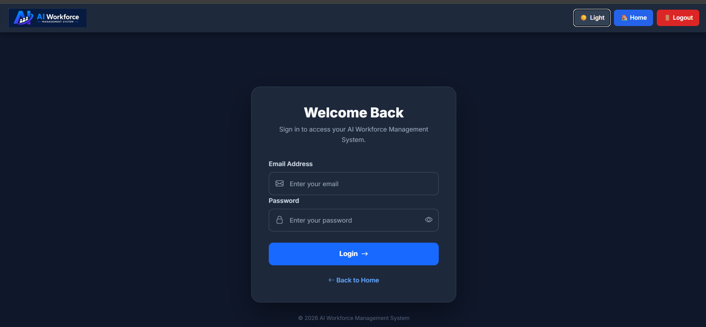

### 👨‍💼 Admin Dashboard
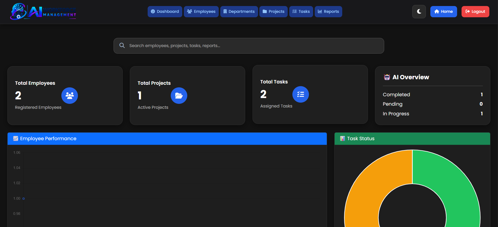

### 👨‍💼 Manager Dashboard
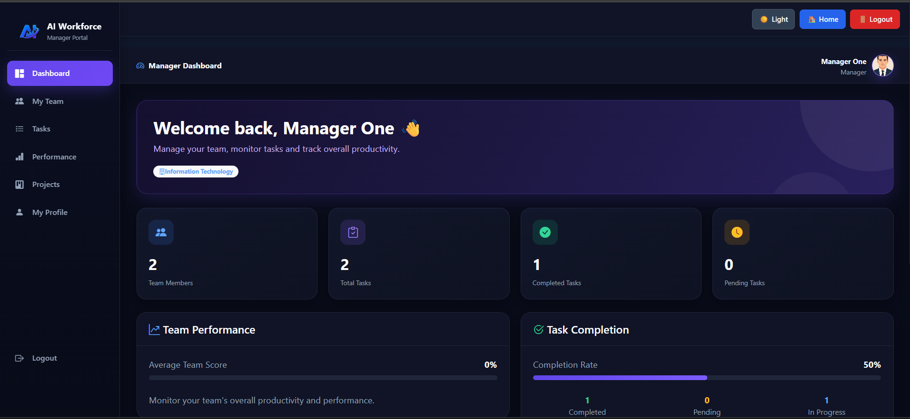

### 👩‍💻 Employee Dashboard
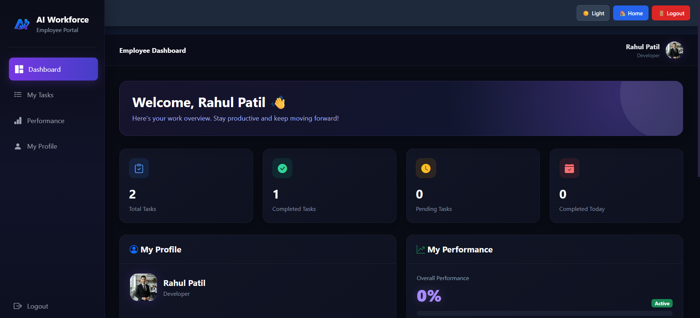

### 🤖 AI Employee Recommendation
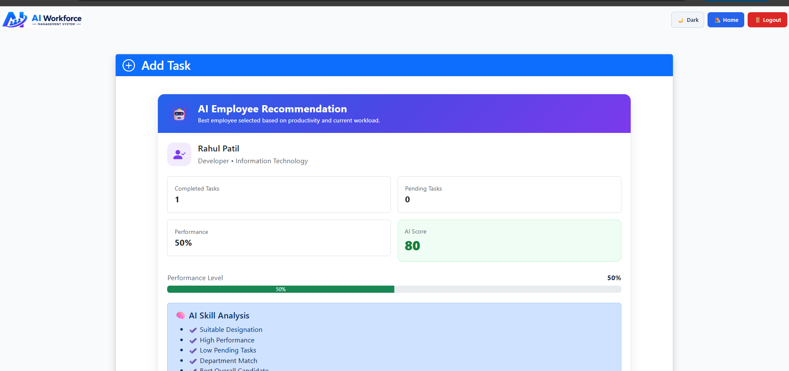

### 📋 Task Management
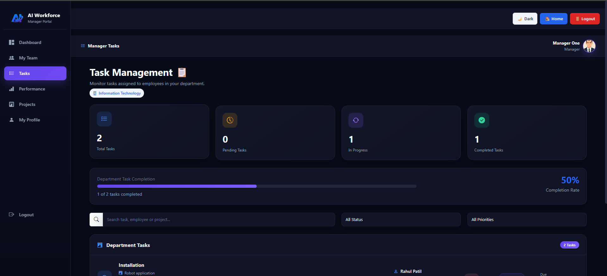

### 📊 Reports & Analytics
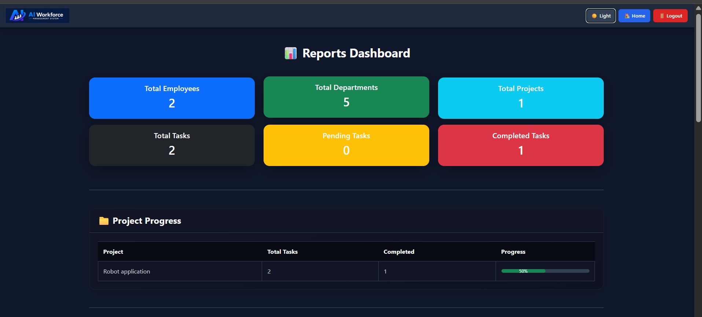

### 👤 Employee Profile
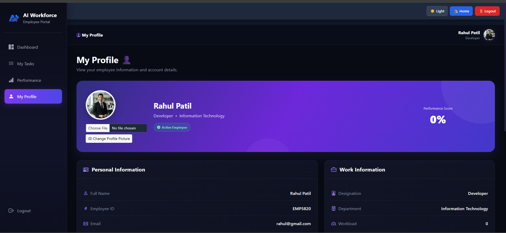

### 👥 Manager Team Management
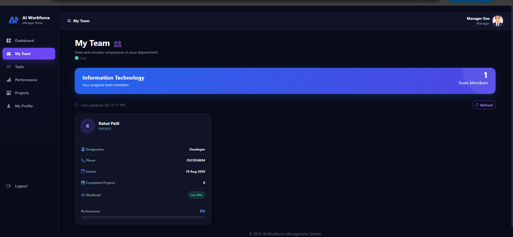

### 📁 Project Management
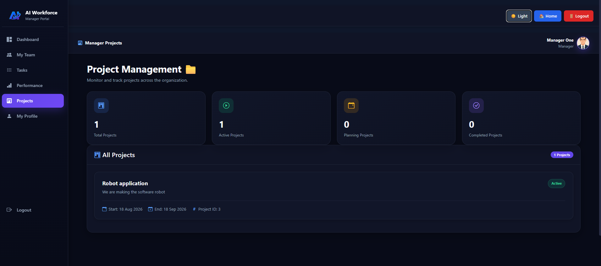


# ⚙️ Installation & Setup

## 1. Install XAMPP

Install **XAMPP** with:

* Apache
* MySQL
* PHP
* phpMyAdmin

---

## 2. Clone the Repository

Open Command Prompt:

```bash
cd C:\xampp\htdocs
```

Clone the project:

```bash
git clone https://github.com/pratikshakanadje636-ux/AI-Workforce-Management-System.git
```

---

## 3. Open the Project

After cloning:

```text
C:\xampp\htdocs\AI-Workforce-Management-System
```

---

## 4. Start XAMPP

Open XAMPP Control Panel and start:

```text
Apache
MySQL
```

---

## 5. Create the Database

Open:

```text
http://localhost/phpmyadmin
```

Create the required database and import the project's SQL database file.

> Use the database name/configuration expected by `config/database.php`.

---

## 6. Configure Database Connection

Open:

```text
config/database.php
```

Configure:

```php
$host = "localhost";
$username = "root";
$password = "";
$database = "your_database_name";
```

Use the database name created during setup.

---

## 7. Run the Project

Open the project through:

```text
http://localhost/AI-Workforce-Management-System/
```

Then open the login page.

---

# 🔑 User Roles

The system contains three main roles:

| Role     | Main Responsibility                        |
| -------- | ------------------------------------------ |
| Admin    | Manage organization and system data        |
| Manager  | Manage projects, teams and tasks           |
| Employee | Manage assigned tasks and view performance |

---

# 🔄 Task Management Workflow

```text
Manager/Admin
      │
      ↓
Create Task
      │
      ↓
AI analyzes employees
      │
      ↓
Best employee recommended
      │
      ↓
Employee selected
      │
      ↓
Task assigned
      │
      ↓
Employee works on task
      │
      ↓
Task status updated
      │
      ↓
Performance updated
      │
      ↓
Reports & Analytics
```

---

# 📈 Performance Calculation

Employee performance is based on task completion.

The general calculation used by the system is:

```text
Performance =
Completed Tasks / Total Tasks × 100
```

The system also considers pending workload while generating AI recommendations.

---

# 🧠 AI Insights

The reports dashboard evaluates the overall completion rate.

The system classifies performance approximately as:

```text
80% and above  → Excellent
60% – 79%      → Good
40% – 59%      → Average
Below 40%      → Needs Improvement
```

It also provides project status predictions such as:

```text
High completion rate
        ↓
Likely to finish on time
```

and:

```text
Low completion rate
        ↓
Higher risk of project delay
```

These are **rule-based AI-style insights**, implemented using application logic and database information.

---

# 🌙 UI & Design

The project uses a modern dashboard-style interface with:

* Responsive layouts
* Bootstrap components
* Bootstrap Icons
* Dashboard cards
* Progress bars
* Tables
* Charts
* Profile cards
* AI recommendation cards
* Dark-mode support on implemented pages
* Responsive employee/manager interfaces

---

# 🔧 Development

### Git status

Check project changes:

```bash
git status
```

### Add changes

```bash
git add .
```

### Commit

```bash
git commit -m "Your commit message"
```

### Push to GitHub

```bash
git push origin main
```

---

# 🚀 Future Improvements

Possible future enhancements include:

* Advanced machine-learning employee recommendation
* Skill-based task matching
* Real-time notifications
* Email notifications
* Advanced workload prediction
* Leave management
* Attendance management
* Team productivity analytics
* AI-generated performance reports
* More advanced project forecasting
* REST API integration
* Cloud deployment
* Role-based permission management
* Automated testing

---

# 🎯 Project Goals

The main goals of the project are to:

* Simplify workforce management
* Improve task allocation
* Monitor employee productivity
* Reduce employee workload imbalance
* Provide data-driven insights
* Help managers make better assignment decisions
* Centralize workforce information
* Demonstrate practical use of AI-style decision logic in a full-stack application

---

# 👩‍💻 Developer

**Pratiksha Kamalakar Kanadje**

Bachelor of Computer Science
Deogiri Institute of technology and management studies,chhatrapati sambhajinagar
/ Dr. Babasaheb Ambedkar Marathwada University

---

# 📌 Project Status

**Status: Completed / Portfolio Ready 🚀**

The major Admin, Manager, Employee, Task Management, Profile, Performance, Reports, Analytics, and AI Employee Recommendation features have been implemented and tested during development.

---

## ⭐ Acknowledgement

This project was developed as a practical full-stack application to demonstrate skills in:

**PHP + MySQL + HTML + CSS + JavaScript + Bootstrap + Chart.js + Git/GitHub + AI-based decision logic**

---

## 📄 License

This project is intended primarily for educational, academic, and portfolio purposes.
